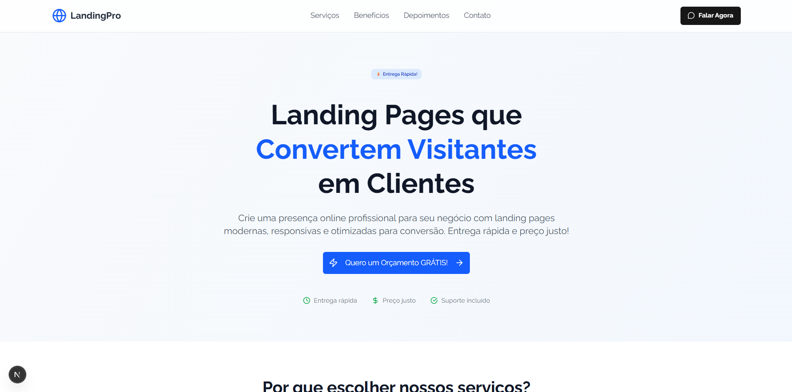
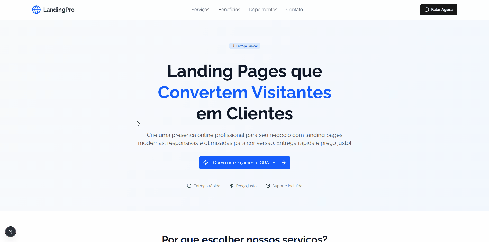
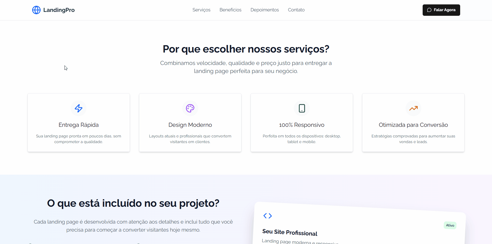

# LandingPro: Landing Page de Alta Conversão para Negócios



> Este projeto é mais do que um simples site: é uma demonstração prática de como uma landing page bem construída pode ser a ferramenta mais poderosa para transformar visitantes em clientes. O objetivo é servir como meu portfólio principal e, ao mesmo tempo, como uma solução real para pequenos e médios negócios que buscam uma presença online eficaz e com retorno rápido.

**[➡️ Visite a Landing Page ao Vivo] https://professional-landing-page-zeta.vercel.app/**

---

## 1. O Problema: A Lacuna Digital para Pequenos Negócios

No cenário digital atual, muitos empreendedores e pequenos negócios enfrentam um dilema:

- **Sites institucionais complexos** são caros, demoram para serem desenvolvidos e muitas vezes confundem o cliente com excesso de informação.
- **Perfis em redes sociais** são ótimos para engajamento, mas não oferecem um funil de vendas claro e profissional.

A consequência é a perda de clientes potenciais que buscam uma informação rápida, direta e um caminho claro para a compra ou contato. A LandingPro foi criada para resolver exatamente essa dor, oferecendo uma solução focada, rápida e com um único objetivo: **conversão**.

---

## 2. Decisões Técnicas e Trade-offs (Por que esta Stack?)

A escolha da tecnologia foi estratégica para garantir performance, escalabilidade e uma experiência de desenvolvimento ágil, refletindo a qualidade que ofereço aos meus clientes.

- **Framework:** **Next.js (App Router)**

  - **Justificativa:** Optei pelo Next.js por sua capacidade de renderização híbrida (SSR/SSG), otimização de imagens (`<Image />`) e performance de carregamento superior. Isso garante um **SEO excelente** e uma **experiência de usuário impecável**, fatores cruciais para reter visitantes e converter. O App Router foi escolhido por ser a arquitetura mais moderna e recomendada pela Vercel.

- **Estilização:** **Tailwind CSS**

  - **Justificativa:** Em vez de bibliotecas de componentes prontas, o Tailwind CSS me permite criar um **design 100% customizado e responsivo** de forma rápida e consistente. O resultado é um código CSS enxuto, sem sobreposição de estilos, e um visual único para cada projeto.

- **Hospedagem:** **Vercel**
  - **Justificativa:** Como a criadora do Next.js, a Vercel oferece a plataforma mais otimizada para o deploy. Com integração contínua via Git, **deploys automáticos**, URLs de preview e uma CDN global, consigo garantir que a landing page esteja sempre no ar, rápida e acessível de qualquer lugar do mundo. Isso se traduz em **confiabilidade e velocidade** para o cliente final.

---

## 3. Desafios Enfrentados e Soluções

Durante o desenvolvimento, me deparei com decisões de arquitetura e implementação que foram cruciais para a qualidade e manutenibilidade do projeto.

- **Desafio: Criar Componentes Reutilizáveis sem Bibliotecas Externas**

  - **Problema:** A página possui várias seções com cards e listas que seguem um padrão visual (ex: "Nossos Serviços", "O que está incluído", "Depoimentos"). Criar cada card manualmente resultaria em código repetitivo, difícil de manter e propenso a erros.
  - **Solução:** Em vez de instalar uma biblioteca de componentes, optei por uma abordagem mais limpa e performática. Estruturei os dados de cada seção como um array de objetos em JavaScript. Em seguida, utilizei a função `.map()` do React para iterar sobre esses arrays e renderizar dinamicamente cada card. Isso não só manteve o código limpo e organizado (princípio DRY - Don't Repeat Yourself), mas também tornou extremamente fácil adicionar, remover ou reordenar itens no futuro, bastando apenas modificar o array de dados.

- **Desafio: Facilitar o Primeiro Contato do Cliente (Call to Action)**
  - **Problema:** O objetivo principal da landing page é gerar leads. Um formulário de contato tradicional pode criar atrito e diminuir a taxa de conversão. A maioria dos clientes de pequenos negócios prefere a agilidade do WhatsApp.
  - **Solução:** Implementei uma integração direta com a API do WhatsApp. O desafio era não apenas direcionar o cliente para o aplicativo, mas também **pré-preencher uma mensagem inicial** ("Olá! Vi sua página e gostaria de um orçamento..."). Para isso, utilizei a função `encodeURIComponent()` do JavaScript para formatar a mensagem corretamente na URL, garantindo que ela funcione em todos os navegadores e dispositivos sem quebras por causa de espaços ou caracteres especiais. Isso reduz o esforço do cliente a um único clique, aumentando significativamente a probabilidade de ele iniciar uma conversa.

---

## 4. Lições Aprendidas e Melhorias Futuras

Este projeto reforçou a importância de uma base técnica sólida para alcançar objetivos de negócio.

- **Lições:** A performance não é um luxo, é uma necessidade. Uma landing page rápida e bem otimizada transmite profissionalismo e respeito pelo tempo do usuário.
- **Melhorias Futuras:**
  - [ ] Adicionar um pequeno formulário de contato com integração a uma API (Resend) como alternativa ao WhatsApp.
  - [ ] Criar um "Modo Escuro" (Dark Mode) para aprimorar a experiência do usuário.

---

## 5. Demonstração da Aplicação

A LandingPro foi projetada com a filosofia "Mobile-First", garantindo uma experiência de usuário impecável tanto em desktops quanto em dispositivos móveis. Os GIFs abaixo demonstram a fluidez, a responsividade e as micro-interações da página em ambas as plataformas.

| Versão Desktop                                | Versão Mobile                             |
| --------------------------------------------- | ----------------------------------------- |
|  |  |

### GIFs de Seções-Chave

| Seção Hero                         | Seção de Benefícios                         |
| ---------------------------------- | ------------------------------------------- |
|      |  |
| _Captura a atenção imediatamente._ | _Detalha os benefícios de forma visual._    |

---

## 🚀 Como Executar o Projeto Localmente

Caso queira explorar o código:

1.  **Clone o repositório:**
    ```bash
    git clone https://github.com/Luiz-HQ/LandingPro.git
    ```
2.  **Navegue até a pasta do projeto:**
    ```bash
    cd .\LandingPro\
    ```
3.  **Instale as dependências:**
    ```bash
    npm install
    ```
4.  **Execute o servidor de desenvolvimento:**
    `bash
npm run dev
`
    Acesse `http://localhost:3000` no seu navegador para ver a aplicação.
